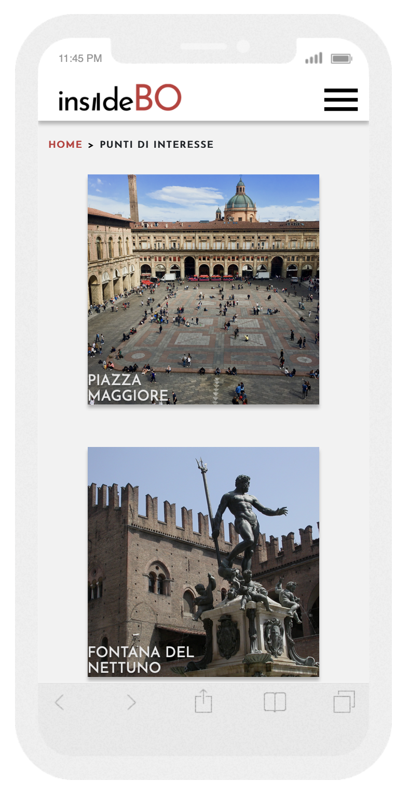
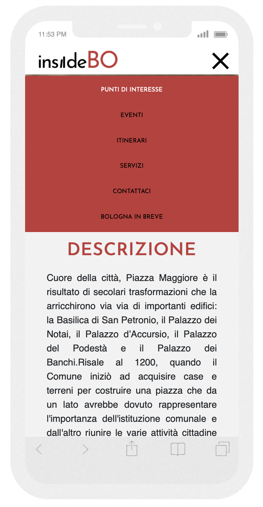
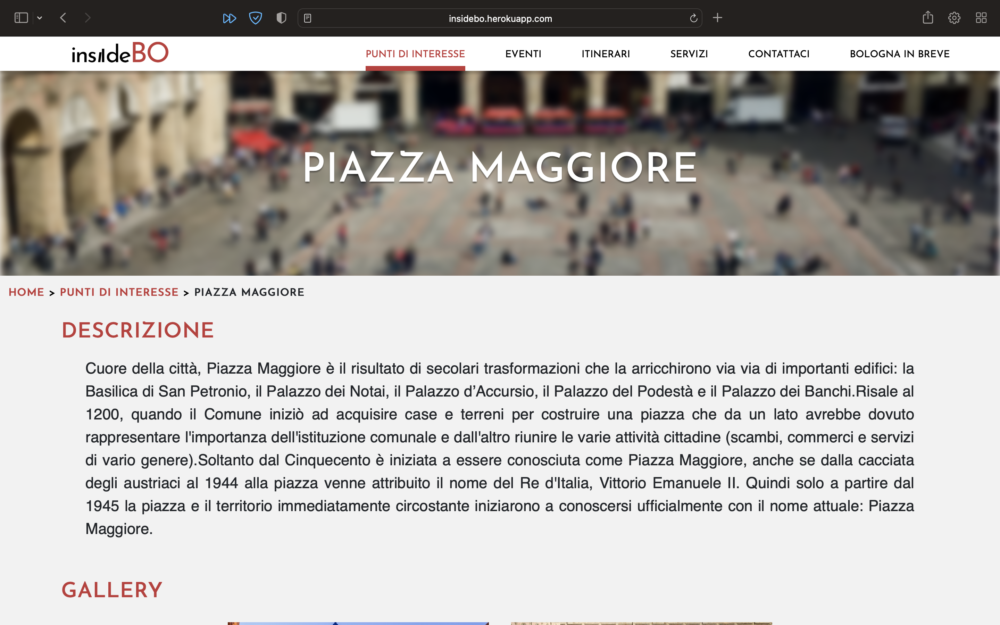
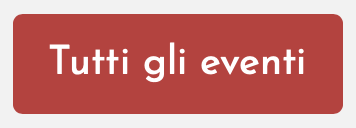
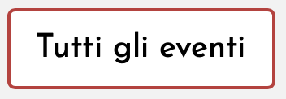

# Technical Documentation

## **Work Breakdown**

We developed the project by defining common guidelines for development. Each member of the group was able to touch on all aspects relating to the development. In particular:

| Member          | Main focus                                            |
| --------------- | ----------------------------------------------------- |
| Davide Carini      | |
| Daniele Casciani  |         |
| Riccardo Pestrin|         |
| Antony Pascalino|           |

 

---

## **Technologies and Motivations**

- For the _server side_ development we have used **NodeJS with ??????????**.
- For the _hosting_ our application we have used **Heroku**. The website is accessible at [insideBO.herokuapp.com](https://insidebo.herokuapp.com/).
- Since the website is data-base driven, for the _database implementation_ we have used **PostgreeSQL**.

 

---

## **Best Practices Compliance**

During the development of the system, all principles of good practice were followed. In particular:

- Every relevant aspect of the code has been **highly commented** (html structure, components, server, database structure) in order to facilitate reading.
- All the principles of **accessibility** have been scrupulously followed. In particular, the W3C-WAI ?????????? standards were followed. Some of the measures adopted:
  - [x] Brief descriptions of non-text content (such as images) are provided
  - [x] Labels for form controls, input, and other user interface components are provided
  - [x] Headings, lists, input fields, and content structures are marked-up properly
  - [x] Sequences of information or instructions are independent of any presentation
  - [x] Default foreground, background color combinations and images provide sufficient contrast
  - [x] Text reflows in small viewports and when users make the text larger
  - [x] Images of text are completely avoided
  - [x] All functionality that is available by mouse is also available by keyboard
  - [x] Pages are organized using descriptive section headings
  - [x] There is more than one way to find relevant pages within a set of web pages
  - [x] Users are informed about their current location within a set of related pages
  - [x] The purpose of links is evident
  - [x] Buttons, links, and other active components are large enough to make them easier to activate by touch

- The website has been developed with attention to **SEO ranking**. In addition to what is listed above, all pages have been provided with appropriate meta tags.
- Reusable and modular Nuxt components **????????**

> All the pages of the website have been analyzed with the following tools:
>
> - **??????WAVE??????**: no errors, warning or contrast error have been detected
> - **Google Lighthouse**: all Performance, Best Practices and Accessibility tests have been successfully passed with an average score of 100-95.

> **NOTICE: The performance score on some pages is negatively affected by them ???????????**.

[//]: # (Here include the image fo analysis tools for performance and accessibility)
**????????**

---

## **Responsiveness**

The entire website was developed with responsiveness in mind. Each component is therefore able to adapt and change its appearance based on the screen size of current device.  
Some of the most notable responisive adaptions are:
- The Header component, showing the complete navigation bar, is hidden and replaced by a burger menu on tight screen devices. (See more in the Components section **???METTERE LINK??**)
- The Carousel component, used to show the items in Punti di interesse, Eventi, Itinerari and Servizi sections, drastically changes its design based on the viewport of the current device allowing to browse the items using the most intuitive method for each device's screen. (See more in the Components section **???METTERE LINK??**)
- The ItineraryPath component used to show the points of interest belonging to a particular itinerary, is horizontally oriented on horizontally oriented screens, vertically oriented on vertically oriented screens. (See more in the Components section **???METTERE LINK??**)
- The font size of paragraphs and headers is always adaptive to the screen size, in order to allow a comfortable reading from the user.

Here are shown some graphical instances where is possible to look at the differences just explained. 

|                    Phone                    |                Computer                |
|:-------------------------------------------:|:--------------------------------------:|
|     |   |
|    |  |

 

---

## **Plugins**
??????????????

---

## **Components**

We have developed the components of the website trying to maximize their _reusability_ on the various pages. This, in addition to allowing _modularity_, also has benefits on the _usability_ of the system. In fact, the user views familiar components while browsing the website. 

## **_BaseButton_**

  A general purpose button, picking up the main colors of the website: red and white. On mouse hover the button is substituted with a version with white background.
  **Actual usage on the website:** as button for links to other sections of the website or to external links.

  |  Prop   |   Type   | Note                                                       |
  |:-------:|:--------:|:-----------------------------------------------------------|
  | `Title` | `String` | The label shown inside the button, clarify its purpose     |
  | `goTo`  | `String` | The link (internal or external) to which the button brings |

  |      Method      | Parameter Type |                                Note                                 |
  |:----------------:|:-------------------------------------------------------------------:|:-----------------------------------------------------------------------|
  | `goToFunction()` |      `/`       |Triggered by _click_ event, bring to the path specified by goTo string |

  #### Example

    <baseButton title="Tutti gli eventi" goto="eventi"></baseButton>

|  |   |
|:--------------------------------------------:|:----------------------------------------------:|
|                 Base button                  |              Base button on hover              |
 

***

- ## **_Breadcrumb_**
   
- The Carousel component, used in Punti di interesse, Eventi, Itinerari and Servizi sections, drastically changes based on the viewport of the current device: on computers' browsers it shows an item per time allowing to browse all of them through scroll gesture, buttons and clickable list; on mobile devices, with a vertically oriented screen, it shows all the items in column allowing the user to browse them scrolling up and down with the intuitive scroll touch gesture, mainly used in most of the mobile oriented applications.
