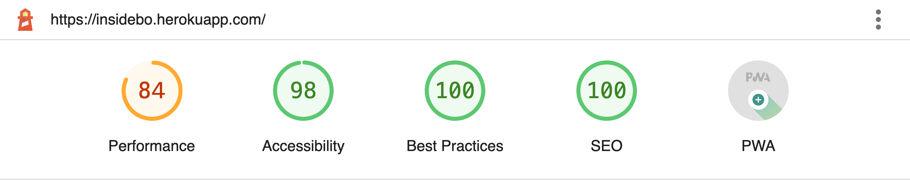

# Technical Documentation

## **Work Breakdown**

We developed the project by defining common guidelines for development. Each member of the group was able to touch on all aspects relating to the development. In particular:

|      Member       | Main focus                                       |
|:-----------------:|--------------------------------------------------|
|   Davide Carini   | Focus on DB modeling and component development   |
| Daniele Casciani  | Focus on component development and documentation |
| Riccardo Pestrin  | Focus on component development and UI Design     |
| Antony Pascalino  | Focus on component development and CSS styling   |

 

---

## **Technologies and Motivations**

- For the _server side_ development it has been used **Nuxt.js** that is a open source javaScript library based on Vue.js,Node.js, Webpack and Babel.js.
- For _hosting_ the application it has been used **Heroku**. The website is accessible at [insideBO.herokuapp.com](https://insidebo.herokuapp.com/).
- Since the website is data-base driven, for the _database implementation_ we have used **PostgreeSQL** and **pgAdmin 4**.

 

---

## **Best Practices Compliance**

During the development of the system, all principles of good practice were followed. In particular:

- Every relevant aspect of the code has been **highly commented** (html structure, components, server, database structure) in order to facilitate reading.
- All the principles of **accessibility** have been scrupulously followed. In particular, the W3C-WAI standards were followed. Some of the measures adopted:
  - [x] Brief descriptions of non-text content (such as images) are provided
  - [x] Labels for form controls, input, and other user interface components are provided
  - [x] Headings, lists, and content structures are marked-up properly
  - [x] Sequences of information or instructions are independent of any presentation
  - [x] Default foreground, background color combinations and images provide sufficient contrast
  - [x] Images of text are completely avoided
  - [x] Pages are organized using descriptive section headings
  - [x] There is more than one way to find relevant pages within a set of web pages
  - [x] Users are informed about their current location within a set of related pages
  - [x] The purpose of links and buttons is evident
  - [x] Buttons, links, and other active components are large enough to make them easier to activate by touch

- The website has been developed with attention to **SEO ranking**. In addition to what is listed above, all pages have been provided with appropriate meta tags.
- Reusable and modular Nuxt components

> All the pages of the website have been analyzed with the following tools:
>
> - **WAVE**: no errors and no contrast errors, some minor warnings have been detected.
> - **Google Lighthouse**: all Performance, Best Practices and Accessibility tests have been successfully passed with an average score of 100-95.

> **NOTICE: The performance score on some pages is negatively affected by the presence of several images, but conisdering that the hosting application limits the download bandwidth and that the 
> nowadays connection are fast enough, it is not been considered as a problem.**.

|  |  |
|:--------------------------------------:|:--------------------------------------------:|
|              Wave report               |           Google Lighthouse report           |

---

## **Responsiveness**

The entire website was developed with responsiveness in mind. Each component is therefore able to adapt and change its appearance based on the screen size of current device.  
Some of the most notable responisive adaptions are:
- The Header component, showing the complete navigation bar, is hidden and replaced by a burger menu on tight screen devices. (See more in the [Components](#Components) section)
- The Carousel component, used to show the items in Punti di interesse, Eventi, Itinerari and Servizi sections, drastically changes its design based on the viewport of the current device allowing to browse the items using the most intuitive method for each device's screen. (See more in the [Components](#Components) section)
- The ItineraryPath component used to show the points of interest belonging to a particular itinerary, is horizontally oriented on horizontally oriented screens, vertically oriented on vertically oriented screens. (See more in the [Components](#Components) section)
- The font size of paragraphs and headers is always adaptive to the screen size, in order to allow a comfortable reading from the user.

Here are shown some graphical instances where is possible to look at the differences just explained. 

|                    Phone                    |                Computer                |
|:-------------------------------------------:|:--------------------------------------:|
|     |   |
|    |  |

 

---

## **Components**

We have developed the components of the website trying to maximize their _reusability_ on the various pages. 
This, in addition to allowing _modularity_, also has benefits on the _usability_ of the system. 
Indeed, the user views familiar components while browsing the website.  
Here a brief description of each component in alphabetical order.

- ## **_BaseButton_**

A general purpose button, picking up the main colors of the website: red and white. On mouse hover the button is substituted with a version with white background.
**Actual usage on the website:** as button for links to other sections of the website or to external links.

|  Prop   |   Type   | Note                                                       |
|:-------:|:--------:|:-----------------------------------------------------------|
| `Title` | `String` | The label shown inside the button, clarify its purpose     |
| `goTo`  | `String` | The link (internal or external) to which the button brings |

|      Method      | Parameter Type |                                Note                                 |
|:----------------:|:-------------------------------------------------------------------:|:-----------------------------------------------------------------------|
| `goToFunction()` |      `/`       |Triggered by _click_ event, bring to the path specified by goTo string |

  #### Example

    <baseButton title="Tutti gli eventi" goto="eventi"></baseButton>

|  |   |
|:--------------------------------------------:|:----------------------------------------------:|
|                 Base button                  |              Base button on hover              |

***

 

- ## **_Breadcrumb_**

A dynamic breadcrumb. The route to be shown is defined by the query-parameter 'route' in the URL.
**Actual usage on the website:** it shows, in (almost) every page, at most the three main levels of the website: from the homepage, to one of the main section, to one of the item of such section.
Once user clicks on an upper level, the link brings it to the respective page.

|       Prop       |    Type    |  Default  | Note                                                                                                                                                                                                         |
|:----------------:|:----------:|:---------:|:-------------------------------------------------------------------------------------------------------------------------------------------------------------------------------------------------------------|
|  `defaultRoute`  |  `Array`   |   `[]`    | (Required) The default breadcrumb defined as an array of pairs (path,title). It's the route shown when no other alternative route is activated. E.g., `[{ title: 'Areas', path: '/areas' }]`                 |
|  `currentPage`   |  `String`  |   `""`    | Name of the current page. E.g., `Service XYZ`                                                                                                                                                                |

  #### Example

    <breadcrumb :default-route="[{ title: 'HOME', path: '/' },{ title: 'Eventi', path: '/eventi/' },]" :current-page="name"/>

|  |
|:--------------------------------------------:|
|         Breadcrumb of an event page          |
 

***

- ## **_Card_**

It is a container with an image inside it.
**Actual usage on the website:** used in the pages of the single items (single events, point of interest, itineraries) to show the photos of the gallery section. Its image is shown in its full size once clicked

| Note                                                                                                        |
|-------------------------------------------------------------------------------------------------------------|
| Since every gallery section has more than one photo, the component is always used through a v-for construct |

  #### Example

          < card
            v-for="(img, index) of imgArray"
            class="col-sm-2 m-1"
            :key="index"
            :img="`../Events/${img}`"
          />

|  |
|:--------------------------------------:|
|    Cards in tha gallery of an event    |
 

***

- ## **_CardInfo_**

It is a component composed by an image, its caption and a button.
**Actual usage on the website:** used mainly in the homepage of the website to briefly show some items. 
The button brings to the item's page.  
When the item is an event, it also shows in the caption the starting date and the location of the event.

| Note                                                                                                                 |
|----------------------------------------------------------------------------------------------------------------------|
| Since in some pages, such as the homepage, several cards are shown, the component is used through a v-for construct  |

  #### Example

          < cardInfo
            v-for="(poi, index) of poiList"
            class="col-sm-1 m-2"
            :key="`index-${index}`"
            :name="poi.name"
            :img="`../Poi/${poi.imgBackground}`"
            :id="poi.id"
            link="pois"
          />

|    |  |
|:--------------------------------------------:|:-------------------------------------------:|
| Point of interest Info-cards in the homepage |      Events Info-cards in the homepage      |
 

***

- ## **_CardService_**

It is a component composed by a title and three different lines of text.
**Actual usage on the website:** it is used in the service type pages to list the available services.   
The title is the service name and the three lines are respectively the address, the opening time, the phone number and the link to the service's website.

| Note                                                                                                                   |
|------------------------------------------------------------------------------------------------------------------------|
| Since several services are shown in the service type page, the service cards are always used through a v-for construct |

  #### Example

          <cardService
            v-for="(s, index) of serviceList"
            class="col-sm-1 m-2"
            :key="`index-${index}`"
            :name="s.name"
            :address="s.address"
            :opening_hours="s.opening_hours"
            :phone="s.phone_number"
            :website="s.website"
          />

|  |
|:---------------------------------------------:|
|        Service cards of movie theaters        |
 

***

- ## **_Carousel_**

It has two button and a container in it.
**Actual usage on the website:** the Carousel component, complementary with [CarouselSlide](#CarouselSlide) component, is the major member of the main sections of the website.
It allows to browse all the items through either the click of the two buttons (prec and next) or through the implemented single scroll gesture.  
Noteworthy is its responsiveness: other than adapt its size to the window, it drastically changes based on the viewport of 
the current device: on computers' browsers it shows an item per time allowing to browse all of them through single scroll gesture, 
buttons and clickable list (see also [CarouselIndicator](#CarouselIndicator) component); on mobile devices, with a vertically oriented screen, 
it shows all the items in column allowing the user to browse them scrolling up and down with the intuitive scroll touch gesture, 
mainly used in most of the mobile oriented applications.

|  Method  | Parameter Type | Note                                                                                                 |
|:--------:|:-------------------------------------------------------------------:|:-----------------------------------------------------------------------------------------------------|
| `prec()` |      `/`       | Triggered by _click_ event, changes the view of the current visible slide, showing the previous one. |
| `next()` |      `/`       | Triggered by _click_ event, changes the view of the current visible slide, showing the next one.     |
  
#### Example

          < carousel 
            class="carousel" 
            @next="next" 
            @prev="prev" 
          >

|        |      |
|:------------------------------------------------:|:------------------------------------------------:|
| Carousel component on horizontal oriented screen |  Carousel component on vertical oriented screen  |
 

***

- ## **_CarouselSlide_**
It is simply a container.
**Actual usage on the website:** it is needed to fulfill the purpose of the [Carousel](#Carousel) component. This component is actually the single slide of the carousel. 
As a slide, it is used including an image inside it enriched with the name of the item and a brief description appearing on hover.

|      Prop      | Note                                                                                                              |
|:--------------:|:------------------------------------------------------------------------------------------------------------------|
|    `index`     | The index that each slide has given to iterate them                                                               |
| `visibleSlide` | The index of the slide to show (they are shown once per time in large screen)                                     |
|      `id`      | The unique index that each slide has given in the server                                                          |
|     `name`     | The name of the category of slides shown in a precise carousel (eventi, pois, services...)                        |
|  `direction`   | The direction of scroll going from a slide to another: used to set the proper animation when scrolling up or down |

| Note                                                                                            |
|-------------------------------------------------------------------------------------------------|
| Since each carousel has several slides, the component are always used through a v-for construct |

#### Example

        < carousel-slide
          v-for="(poi, index) in poiList"
          :key="index"
          :index="index"
          :visibleSlide="visibleSlide"
          :id="poi.id"
          :name="'pois'"
          :direction="direction"
        >

|  |
|:-----------------------------------------------:|
|       A single slide when hovering on it        |
 

***

- ## **_CarouselIndicator_**
It is simply a button with a label.
**Actual usage on the website:** this component provides a further method to browse the slide in a [Carousel](#Carousel). It is a button linked to an items in a carousel: by clicking
it the component set the visible slide of the carousel on the one associated to it. It is needed when it is wanted to jump from a slide to another without scroll them one by one.
Obviously several Indicators are shown at the same time in column, in order to create a clickable list of items.

|      Prop      | Note                                                         |
|:--------------:|:-------------------------------------------------------------|
|    `index`     | The index that each slide has given to iterate them.         |
| `visibleSlide` | The index of the slide to show in the carousel once clicked. |
|    `title`     | The name of the item shown once clicked.                     |

|               Method               |  Parameter Type   | Note                                                                                                            |
|:----------------------------------:|:-----------------:|:----------------------------------------------------------------------------------------------------------------|
|             `change()`             |        `/`        | Triggered by _click_ event, changes the visible slide in the carousel, showing the one linked to the Indicator. |
| `getTextColor(index,visibleSlide)` | `integer,integer` | Used to dynamically change the style, of the Indicators whose linked slide is set to visible in the carousel.   |
|  `getSymbol(index,visibleSlide)`   | `integer,integer` | Used to dynamically change the style, of the Indicators whose linked slide is set to visible in the carousel.   |

|Note                                                                                                                 |
|---------------------------------------------------------------------------------------------------------------------|
| Since it used to create a list of all the items in the page, the component are always used through a v-for construct |

#### Example
        <carousel-indicator
            v-for="(poi, index) in poiList"
            :key="index"
            :index="index"
            :visibleSlide="visibleSlide"
            :title="poi.name"
            @change="change(index)"
        />

|                                                                           |
|:----------------------------------------------------------------------------------------------------------------------------:|
| A list of carousel indicators in events section (Festival della mortadella is the current visible slide in the carousel) |
 

***

- ## **_ItineraryPath_**

It is composed of 5 items, each of them has an image, a title and a link to a page of the website.    
**Actual usage on the website:** used in the single pages of itineraries to show the point of interest inside a specific itinerary
in order to let the user know, in a graphical way, which will be the stops of the route; when the user hover on the item, the name of the 
point of interest appears.
It is noted that the component has an high level of responsiveness, indeed when the screen becomes vertical, also the items are
shown in column and, in order to be used in a smartphone, the single titles appear near to each item, without needing of hover on them.

|   Prop   | Note                                                  |
|:--------:|:------------------------------------------------------|
| `nameX`  | The name of the Xth item of the itinerary             |
| `imageX` | The image of the Xth item of the itinerary            |
|  `idX`   | The id on server of the the Xth item of the itinerary |

#### Example

       <ItineraryPath
        line="/Itineraries/LineaDrittaPNG.png"
        :name1="namePoi1"
        :name2="namePoi2"
        :name3="namePoi3"
        :name4="namePoi4"
        :name5="namePoi5"
        :id1="idPoi1"
        :id2="idPoi2"
        :id3="idPoi3"
        :id4="idPoi4"
        :id5="idPoi5"
        :img1="img1"
        :img2="img2"
        :img3="img3"
        :img4="img4"
        :img5="img5"
      />

|                                  |    |
|:---------------------------------------------------------------------------:|:-----------------------------------------------:|
| Itinerary path on horizontal screen (While hovering on Palazzo re Enzo) |        Itinerary path on vertical screen        |

***

- ## **_Map_**

It has an iframe with a link to a specific location on the map, shown on Google Maps website.  
**Actual usage on the website:** it is used to show, in the single point of interest pages, the exact location of such item.
The user can also click on the link to better explore the location directly on Google Maps website (or application).

|     Prop     |   Type   |                        Note                        |
|:------------:|:--------:|:--------------------------------------------------:|
|    `name`    |   `/`    | The name of the point of interest shown in the map |
| `googleLink` | `String` |  The link to the location on Google Maps website   |

#### Example

       <Map :googleLink="googleLink" :name="name"> </Map>

|  |
|:-------------------------------------:|
|    The location of Piazza Maggiore    |

***

- ## **_SelectFilter_**
By mean of use of a select tag, this component shows a drop-list with 3 options.  
**Actual usage on the website:** used on the Events section to filter the listed events based on the season of them. 
It receives from the server all the events but shows only the corresponding ones.

|      Method       |  Parameter Type   | Note                                                                                                                                      |
|:-----------------:|:-----------------:|:------------------------------------------------------------------------------------------------------------------------------------------|
| `onChange(event)` |        `/`        | Triggered by _click_ event on a specific option, emits the filter-change action which will filter the events based on the option selected |

#### Example

          <select-filter
            class="select-filter"
            @filter-change="filterBySeason"
          />

|  |      |
|:----------------------------------------:|:----------------------------------------------:|
|        The filter when set on All        | The drop-list shown once clicked on the filter |

***

- ## **_StaticFullImage_**
An image with a text label and a button.  
**Actual usage on the website:** used on the Homepage of the website to show the main image once opening for the first time the website.
It also has an arrow shaped button which automatically scroll the page once clicked.

|   Prop   |   Type   |            Note             |
|:--------:|:--------:|:---------------------------:|
| `slide`  | `String` |    The link to the image    |
| `title1` | `String` | A string of the shown label |
| `title2` | `String` | A string of the shown label |

|      Method      | Parameter Type | Note                                                        |
|:----------------:|:--------------:|:------------------------------------------------------------|
| `updateScroll()` |      `/`       | Method on the arrow button to scroll the page once clicked  |

#### Example

    <StaticFullImage @scrollto="goto" slide="/Bologna_Homepage_1.jpg" title1="SCOPRI" title2="BOLOGNA"/>

|  |
|:-------------------------------------------------:|
|             The image on the Homepage             |

***

- ## **_StaticHalfImage_**
An image with a text label.  
**Actual usage on the website:** used on the single item pages of the website as header of the page.

|  Prop   |   Type   |            Note             |
|:-------:|:--------:|:---------------------------:|
| `slide` | `String` |    The link to the image    |
| `title` | `String` | The name of the page's item |

#### Example

      <StaticHalfImage :slide="`../Events/${imgBackground}`" :title="name" />

|  |
|:-------------------------------------------------:|
|             The image on the Homepage             |

***

- ## **_TheFooter_**
A container with an image and several links.  
**Actual usage on the website:** used on the bottom part of (almost) every page of the website. It has the website logo in it and
several links: some of these to internal pages some on external pages.  
It is also responsive, shrinking itself when the page width decrease.

#### Example

      <the-footer/>

|  |
|:-------------------------------------------:|
|                 The footer                  |

***

- ## **_TheHeader_**
It is a container with an image and several labels.  
**Actual usage on the website:** used on the upper part of all the pages, it is the header of the entire website.
It has the logo of the website which brings to the homepage everytime it is clicked and the labels of the main sections of the website which
brings to the respective pages when clicked. The labels are also underlined when the user is on its respective page, for a better orientation in the website.   
It is noted that the component has a high level of responsiveness: when the page width is going to be low, like in a smartphone, the labels
disappear, leaving its place to a menu icon that, once clicked, shows the dropdown menu with the same labels. Such menu could be closed again with
the respective button.

|             Method              | Parameter Type | Note                                           |
|:-------------------------------:|:--------------:|:-----------------------------------------------|
| `changeMobileMenuVisibility()`  |      `/`       | Changes the menu style based on the page width |

#### Example

    <the-header />

|               |
|:--------------------------------------------------------:|
| The header when the user is on Punti di Interesse's page |
|              |
|         The header when the page width is small          |
|              |
|                The header drop-list menu                 |

***

